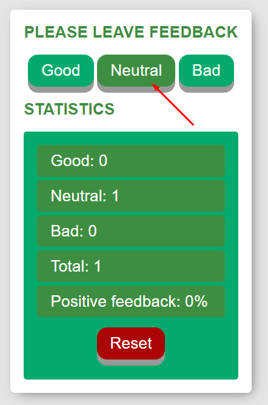
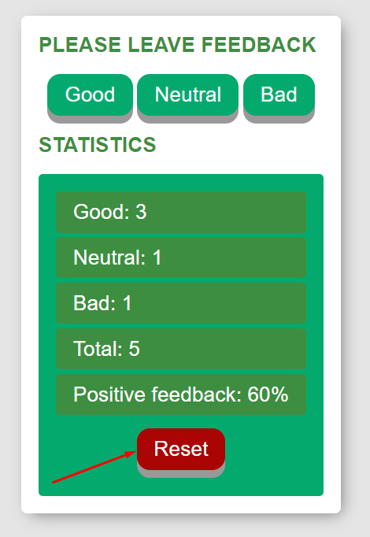

**Read in other languages: [polski](README.pl.md).**

# FeedbackApp

Simple feedback app created to allow you to leave your opinion. 
There is three options : good, neutral, bad.
App will count total and positive feedback.
Created with React.js, HTML, CSS, JS, and a bit of passion...

## Demo
Here is working live demo: ( https://krystianklimczak.github.io/goit-react-hw-02-feedback/ )

## Site

### Landing page

### Simply just click to add your feedback

### You can always reset you feedback

## Technologies
- HTML
- CSS
- JavaScript
- React.js

## Feel free to share your opinion
- ( https://www.linkedin.com/in/klima96/ )